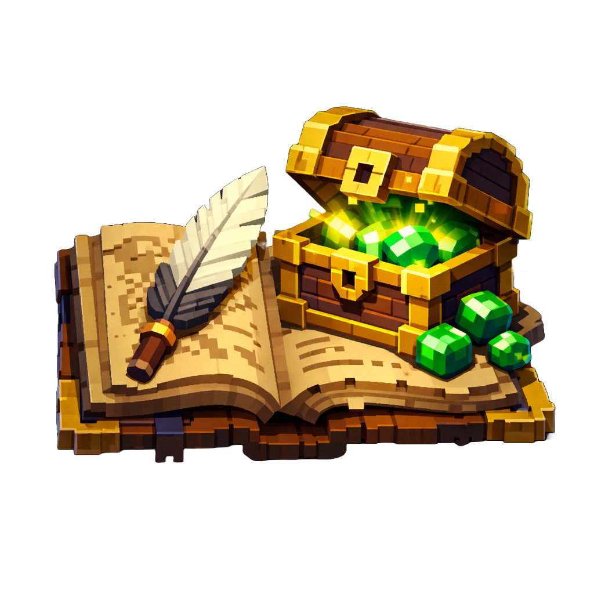
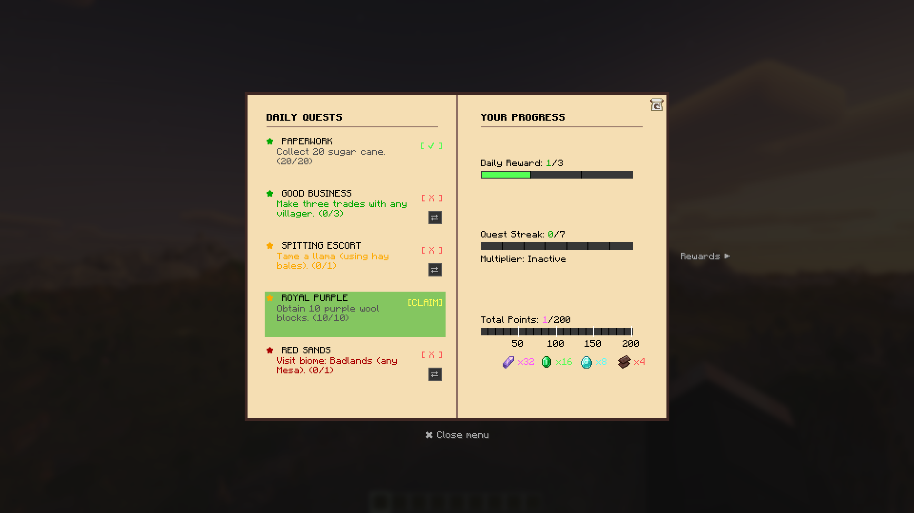
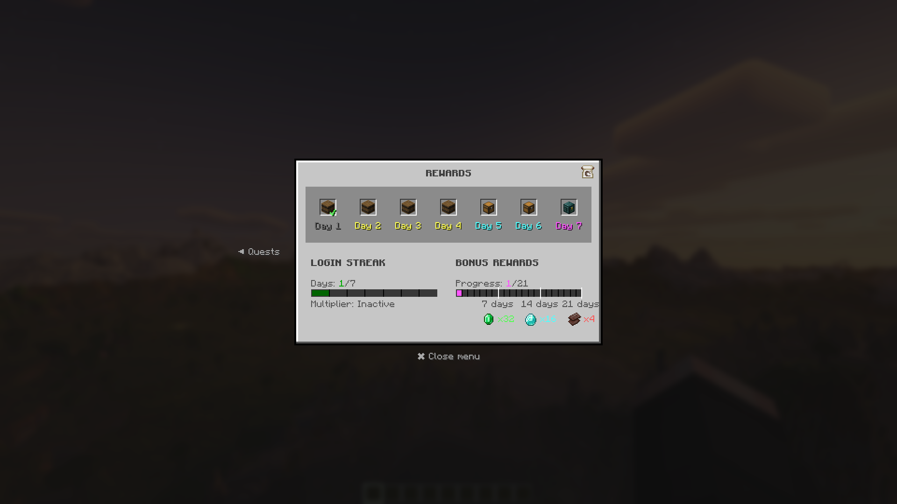
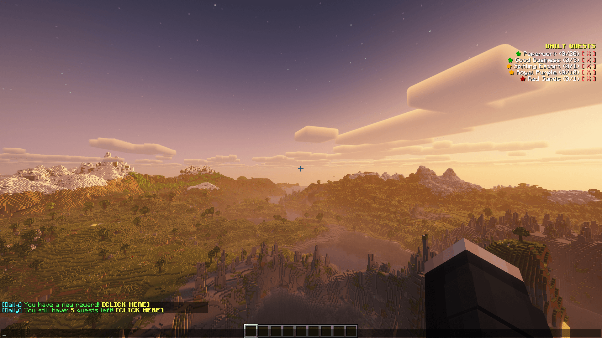

# R3CT Daily Quests & Rewards 🎯

A powerful, highly configurable Daily Quests and Login Rewards mod for Minecraft.
Keep your players engaged with dynamic tasks, login streaks, and a beautifully integrated GUI. Built for both Fabric and NeoForge!

  

---

## ✨ Features

* **⚔️ Daily Quests System:** * Generate random daily tasks from customizable pools.
  * Maintain your Quest Streak by completing tasks daily.
  * **Freeze/Shield System:** Earn shields to protect your streak even if you miss a day!

  

* **🎁 Daily Rewards System:** * Claim escalating rewards for consecutive daily logins.
  * Build up your Reward Streak to earn bonus multipliers.
  * Includes its own separate Shield System to save your login streak.

  

* **🖥️ Beautiful GUI:** * Fully interactive, clean, and modern menus built directly into Minecraft.
  * Track your progress easily (Default keys: `G` for Quests, `H` for Rewards).
  * On-screen HUD to track your active quest progress in real-time. Easily toggle it on or off by pressing the `.` (period) key!

  

* **🔄 Cross-Platform:** * Fully native support and identical features for both **Fabric** and **NeoForge**.

---

## 🔌 Dependencies & Requirements

To run this mod, you will need to install a few library mods depending on your loader:

**For Fabric:**
* [Fabric API](https://modrinth.com/mod/fabric-api) (Required)
* [Cloth Config API](https://modrinth.com/mod/cloth-config) (Required)
* [Mod Menu](https://modrinth.com/mod/modmenu) (Recommended - to access in-game settings)

**For NeoForge:**
* [Cloth Config API](https://modrinth.com/mod/cloth-config) (Required)

---

## 📖 Documentation

For detailed guides on how to set up quests, rewards, and technical mechanics, visit our official Wiki:
👉 **[View the Wiki](https://github.com/R3CTrc/R3CT-Daily-Quests-and-Rewards/wiki)**

<b>Click to see popular topics 💡</b>

* [📥 Getting Started](https://github.com/R3CTrc/R3CT-Daily-Quests-and-Rewards/wiki/Getting-Started)
* [⚔️ Customizing Quests](https://github.com/R3CTrc/R3CT-Daily-Quests-and-Rewards/wiki/Quests-Setup)
* [📅 Setting up Login Rewards](https://github.com/R3CTrc/R3CT-Daily-Quests-and-Rewards/wiki/Daily-Rewards)
* [🖥️ Admin Commands](https://github.com/R3CTrc/R3CT-Daily-Quests-and-Rewards/wiki/Commands-&-Permissions)

---

## ⚙️ Configuration & Customization

The mod is highly customizable! There are two ways to configure the mod:

### 1. In-Game Settings (Client-side)
Players can access the mod settings via **Mod Menu** (on Fabric) or the **Mods tab** (on NeoForge). Here, users can:
* Toggle the on-screen Quest HUD on or off.
* Adjust the X and Y coordinates of the HUD to fit their screen.

### 2. File Configuration (Server-side / Modpack Creators)
All core mechanics, quests, and rewards can be completely rewritten. After running the mod once, navigate to the `config/r3ct/` folder:

* **`quests.json`** - Manage the pool of daily tasks. [Learn more](https://github.com/R3CTrc/R3CT-Daily-Quests-and-Rewards/wiki/Quests-Setup)
* **`daily_quest_rewards.json`** - Configure bonus rewards for finishing 3 quests. [Learn more](https://github.com/R3CTrc/R3CT-Daily-Quests-and-Rewards/wiki/Daily-Quest-Rewards)
* **`daily_rewards.json`** - Customize login streak loot pools. [Learn more](https://github.com/R3CTrc/R3CT-Daily-Quests-and-Rewards/wiki/Daily-Rewards)
* **`r3ctdailyquests.json`** - Tweak core mechanics, reroll costs, and tech rules. [Learn more](https://github.com/R3CTrc/R3CT-Daily-Quests-and-Rewards/wiki/Core-Mechanics)

---

## 📥 Installation

1. Download the latest release from the **Versions** tab.
2. Download the required dependencies listed above for your specific mod loader.
3. Place all `.jar` files into your Minecraft `mods` folder.
4. Launch the game and enjoy!

---

## 💖 Support the Development

I'm a computer science student, and I develop game mods and software in my free time. If my work has improved your server or modpack, consider supporting my coding journey! Every coffee helps me survive late-night debugging sessions. ☕💻

### 🌟 Memberships & Perks
Want to get more involved? Check out my Ko-fi memberships for exclusive perks:
* 🥉 **Iron Supporter:** Behind-the-scenes previews and a special Discord role.
* 🥈 **Gold Supporter:** Voting power for new features and priority issue reviews.
* 🥇 **Diamond Supporter:** Name in the Hall of Fame and custom feature requests!

[Join a Tier and support the mod!](https://ko-fi.com/r3ct_/tiers)

---

## 📄 License
This project is available under the [MIT License](LICENSE). Feel free to learn from the code and include it in your modpacks!